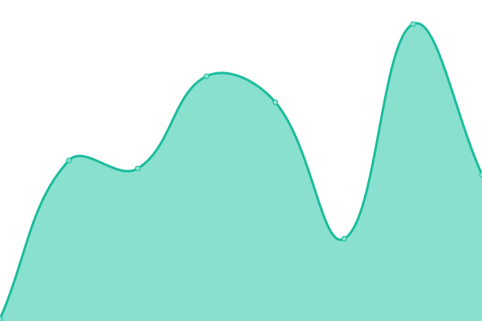

# [📈 Live Status](https://vintagesucks.github.io/uptime): <!--live status--> **🟩 All systems operational**

This repository contains the open-source uptime monitor and status page for [Nikolas Evers](https://nikol.as), powered by [Upptime](https://github.com/upptime/upptime).

With [Upptime](https://upptime.js.org), you can get your own unlimited and free uptime monitor and status page, powered entirely by a GitHub repository. We use [Issues](https://github.com/vintagesucks/uptime/issues) as incident reports, [Actions](https://github.com/vintagesucks/uptime/actions) as uptime monitors, and [Pages](https://vintagesucks.github.io/uptime) for the status page.

<!--start: status pages-->
<!-- This summary is generated by Upptime (https://github.com/upptime/upptime) -->
<!-- Do not edit this manually, your changes will be overwritten -->
<!-- prettier-ignore -->
| URL | Status | History | Response Time | Uptime |
| --- | ------ | ------- | ------------- | ------ |
|  [nikol.as](https://nikol.as/) | 🟩 Up | [nikol-as.yml](https://github.com/vintagesucks/uptime/commits/HEAD/history/nikol-as.yml) | 

 171ms
     
 | 

<a href="https://vintagesucks.github.io/uptime/history/nikol-as">100.00%</a>
    

|  [PPA](https://vintagesucks.github.io/ppa/) | 🟩 Up | [ppa.yml](https://github.com/vintagesucks/uptime/commits/HEAD/history/ppa.yml) | 

 90ms
     
 | 

<a href="https://vintagesucks.github.io/uptime/history/ppa">100.00%</a>
    

|  [PPA (Ubuntu 22.04)](https://vintagesucks.github.io/ppa/ubuntu/jammy/Packages) | 🟩 Up | [ppa-ubuntu-22-04.yml](https://github.com/vintagesucks/uptime/commits/HEAD/history/ppa-ubuntu-22-04.yml) | 

 96ms
     
 | 

<a href="https://vintagesucks.github.io/uptime/history/ppa-ubuntu-22-04">100.00%</a>
    

|  [PPA (Ubuntu 24.04)](https://vintagesucks.github.io/ppa/ubuntu/noble/Packages) | 🟩 Up | [ppa-ubuntu-24-04.yml](https://github.com/vintagesucks/uptime/commits/HEAD/history/ppa-ubuntu-24-04.yml) | 

 85ms
     
 | 

<a href="https://vintagesucks.github.io/uptime/history/ppa-ubuntu-24-04">100.00%</a>
    

|  [Wiki](https://vintagesucks.github.io/wiki/) | 🟩 Up | [wiki.yml](https://github.com/vintagesucks/uptime/commits/HEAD/history/wiki.yml) | 

 62ms
     
 | 

<a href="https://vintagesucks.github.io/uptime/history/wiki">100.00%</a>
    

<!--end: status pages-->

[**Visit our status website →**](https://vintagesucks.github.io/uptime)

## 📄 License

- Powered by: [Upptime](https://github.com/upptime/upptime)
- Code: [MIT](./LICENSE) © [Nikolas Evers](https://nikol.as)
- Data in the `./history` directory: [Open Database License](https://opendatacommons.org/licenses/odbl/1-0/)
